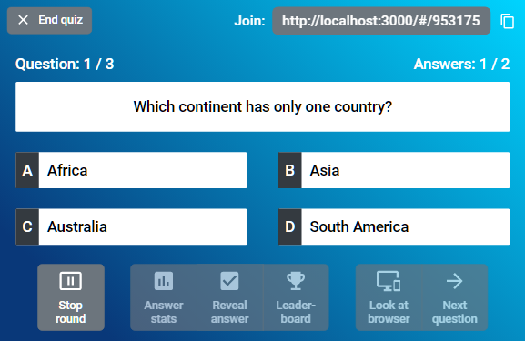
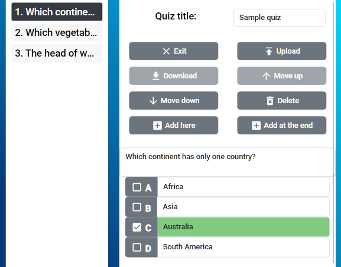
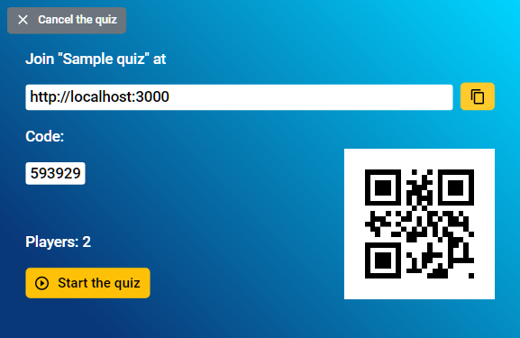
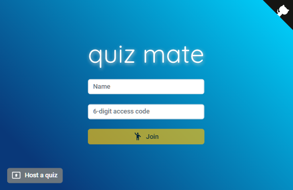
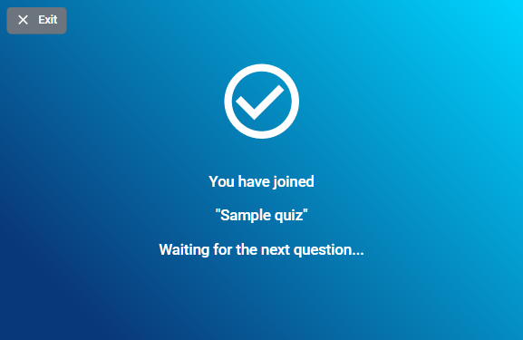
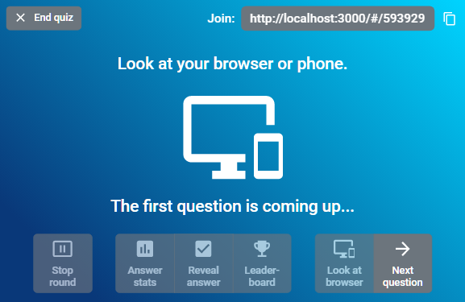
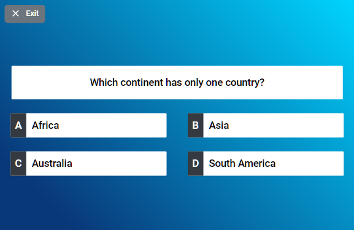
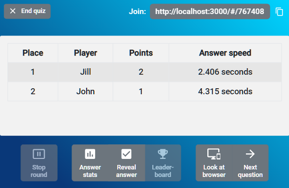
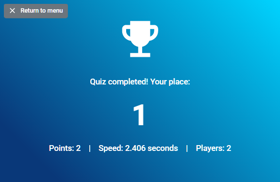

# Quiz Mate

A lightweight self-hosted quiz engine to run interactive real-time quizzes in the browser. This project is a fork of [Quizario](https://github.com/adan2013/Quizario) by Daniel Alberski.



Quiz Mate is an easy way to run multiple-choice quizzes in meetings and (video) conferences. The host activates questions one by one. While a question is active, the players can see it and submit guesses in their browser. The host eventually ends the round and can reveal the right answer, display answer statistics and/or show a leaderboard, before moving on to the next question.

The application runs on Node.js and stores all data in memory. It does not require a database or any other infrastructure. There's no authentication or user management either. Everyone can host and join quizzes.

## Features

- Multiple choice questions with up to 4 answers
- Real-time interaction between host and players
- Image support for questions (up to 5MB per image)
- Answer statistics and leaderboard
- Timer option for questions
- QR code for easy joining
- Downloadable quiz files in JSON format
- No database required - everything runs in memory
- Support for both HTTP and HTTPS

## Creating Quizzes

Quizzes are stored as JSON files. They can be created and edited with the integrated quiz editor:



When creating questions, you can:
- Add text for the question (up to 200 characters)
- Upload an image to illustrate the question (optional, up to 5MB)
- Add up to 4 possible answers
- Mark the correct answer
- Remove or reorder questions

The quiz editor does not store any quizzes on the server. After creating or modifying a quiz, download and store it locally. Every time the quiz is to be hosted, the JSON file must be uploaded again.

## Development Setup

### Option 1: Local Development

To run the application in development mode:

1. Clone the repository:
```bash
git clone https://github.com/david-04/quiz-mate.git
cd quiz-mate
```

2. Install dependencies for both frontend and backend:
```bash
# Install backend dependencies
cd backend
npm install

# Install frontend dependencies
cd ../frontend
npm install
```

3. Build the frontend:
```bash
cd ../frontend
npm run build
```

4. Start the backend server:
```bash
cd ../backend
npm start
```

The application will be available at:
- http://localhost:3001 (HTTP)
- https://localhost:3002 (HTTPS)

### Option 2: Docker Development

You can also run the application using Docker:

1. Build the Docker image:
```bash
# From the project root
docker build -t quiz-mate .
```

2. Run the container:
```bash
# Run with default ports (3001 for HTTP, 3002 for HTTPS)
docker run -p 3001:3001 -p 3002:3002 quiz-mate

# Or run with custom ports (e.g., map to 80 and 443)
docker run -p 80:3001 -p 443:3002 quiz-mate
```

The application will be available at:
- http://localhost:3001 (or http://localhost if mapped to port 80)
- https://localhost:3002 (or https://localhost if mapped to port 443)

Note: The Docker image includes sample SSL certificates for development. For production use, you should mount your own SSL certificates:
```bash
docker run -p 80:3001 -p 443:3002 \
  -v /path/to/your/certs:/app/dist/certs \
  -e HTTPS_CERT_FILE=/app/dist/certs/your-cert.pem \
  -e HTTPS_KEY_FILE=/app/dist/certs/your-key.pem \
  quiz-mate
```

## Building a Release

To build a new release:

1. Update version numbers in:
   - `frontend/package.json`
   - `backend/package.json`
   - `CHANGELOG.md`

2. Build the frontend:
```bash
cd frontend
npm run build
```

3. Copy the built files to the distribution directory:
```bash
# Create dist directory if it doesn't exist
mkdir -p dist

# Copy backend files
cp -r backend/* dist/

# Copy built frontend files
cp -r frontend/build/* dist/public/

# Copy other necessary files
cp README.md LICENSE CHANGELOG.md dist/
```

4. Create a release archive:
```bash
tar -czf quiz-mate-vX.X.X.tar.gz dist/
```

Replace X.X.X with your version number.

Alternatively, you can build a Docker image for distribution:
```bash
docker build -t quiz-mate:vX.X.X .
```

## Installation and usage (locally without Docker)

Install the application:

```
npm install quiz-mate
```

Run the Quiz Mate:

```
quiz-mate
```

When started for the first time, a configuration file is created. It's named `quiz-mate.cfg` and contains settings like the HTTP port. Review the generated file and adjust the settings as required. On UNIX systems, all ports below 1024 are privileged. Either run the Quiz Mate as superuser (via `sudo`) or use a non-standard port (e.g. 8080). Then start the Quiz Mate again:

```
quiz-mate
```

Once the server is up and running, access the web frontend in the browser:

```sh
# when using port 80
http://localhost/

# when using another port (e.g. 8080)
http://localhost:8080/
```

The server stores all data in memory. Don't stop or restart it while hosting a quiz. Once the server stops, all active quizzes are terminated and can't be resumed.

When running the Quiz Mate on a local computer, incoming connections are usually blocked by default. To let others access the web server over the internet, open the respective port(s) in the firewall of the DSL router and/or the operating system.

## Installation and usage (Docker)

The Quiz Mate can be run in Docker using the supplied `Dockerfile`:

```sh
# build the Docker image
curl --silent https://david-04.github.io/quiz-mate/Dockerfile | docker build -t quiz-mate -

# run the application (replace "80" with the preferred host port to bind to)
docker run --rm -it -p 80:8080 quiz-mate
```

The Docker image uses the current Node LTS version and the latest Quiz Mate version. It's preconfigured as follows:

- the HTTP server runs on port 8080 (inside the container - can be mapped to any port on the host)
- HTTPS is disabled
- static assets are served locally (from the container)

The Dockerfile provides build arguments and environment variables to customize the configuration. Please see the documentation on top of the [Dockerfile](https://github.com/david-04/quiz-mate/blob/main/docs/Dockerfile) for details.

Alternatively, the configuration can be stored/maintained on the host:

```sh
# mount a local config directory into the container when running the application
docker run --rm -it -p 80:8080 --volume .:/config quiz-mate
```

The `docker run` command will create a `quiz-mate.cfg` in the current directory (`.`) on the host (unless it already exists). The configuration can be freely edited there. This includes enabling HTTPS.

## Screenshots

Once the quiz has been uploaded, joining instructions are displayed:



Participants scan the QR code or enter the URL in their web browser. They join the quiz by picking a nickname and entering the quiz's access code:



After joining a quiz, players see a confirmation in their browser:



When the host starts the quiz, it displays a reminder, asking players to look at their browser:



Once the host activates a question, participants can see it and submit guesses by clicking on their chosen answer:



After ending the current round, the host can reveal the right answer and show answer statistics:


The host can also display the leaderboard at any time:



The leaderboard is also displayed on the host's screen when a quiz finishes. Additionally, each player can see their individual result in their own browser:



## Limitations

Please be aware of the following limitations:

- The server stores data only in memory. Some quiz data is kept in the host's browser session and not sent to the server at all. This has multiple implications:
  - When the host leaves the quiz, for example by accidentally closing the browser tab, the quiz is terminated. It can't be resumed.
  - Unlike the host, players can re-join a quiz after leaving. However, they won't be able to see the current question. They can only resume participating when the next question is activated.
  - The Quiz Mate can't run in cluster environments like Kubernetes. The host and all players must connect to the same server instance and this instance must remain up and running until the quiz finishes.
- The Quiz Mate does not support authentication or user management. Everyone who can access the web server can host quizzes.
- The server stores quiz data in memory. At the moment, this data is not deleted when a quiz ends. Running the server continuously in a hosting environment might require scheduled restarts from time to time.
- There is no visual indication when a quiz is terminated prematurely.
  - Players won't get a notification when the host accidentally closes the browser. This aborts the quiz and it can't be resumed. But players will continue to see the "Waiting for the next question" screen.
  - The host does not get any notification when the connection to the backend server drops. This could be caused by an unstable internet connection or the backend server being shut down. Although the quiz might be aborted already, the host's screens behave as if it was still active.
